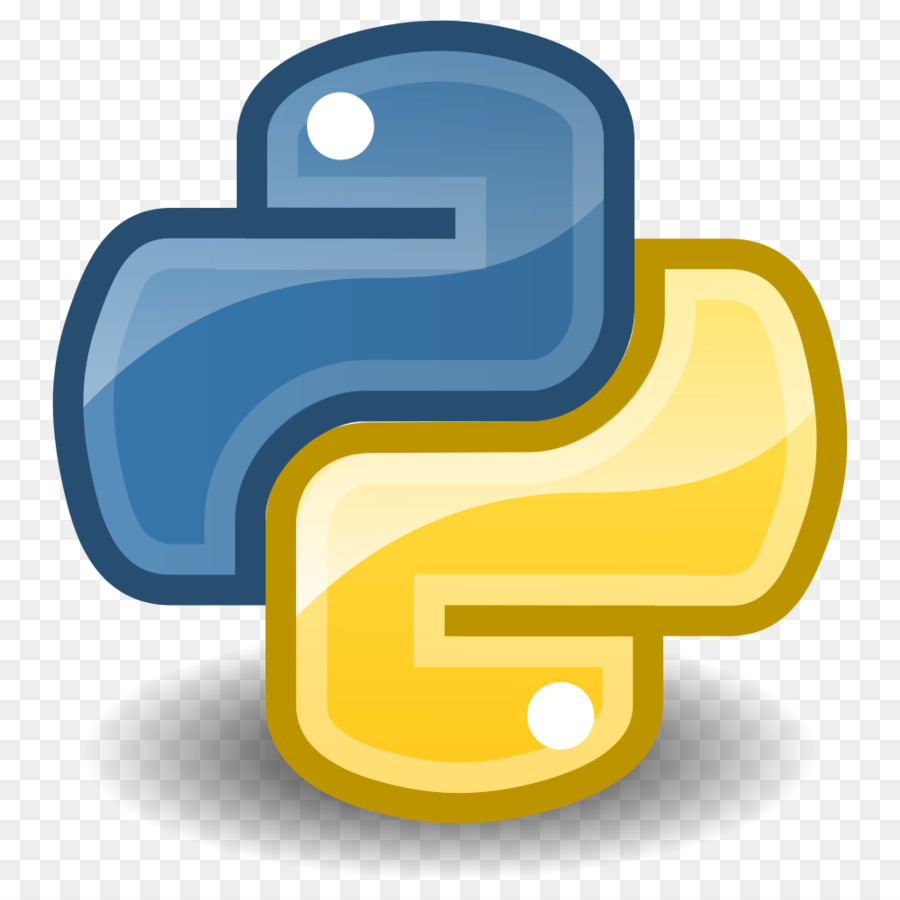
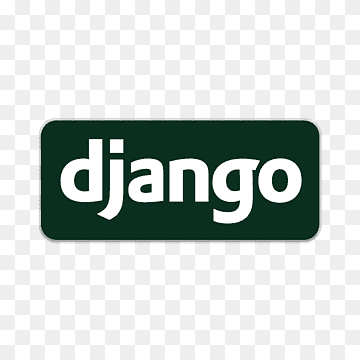
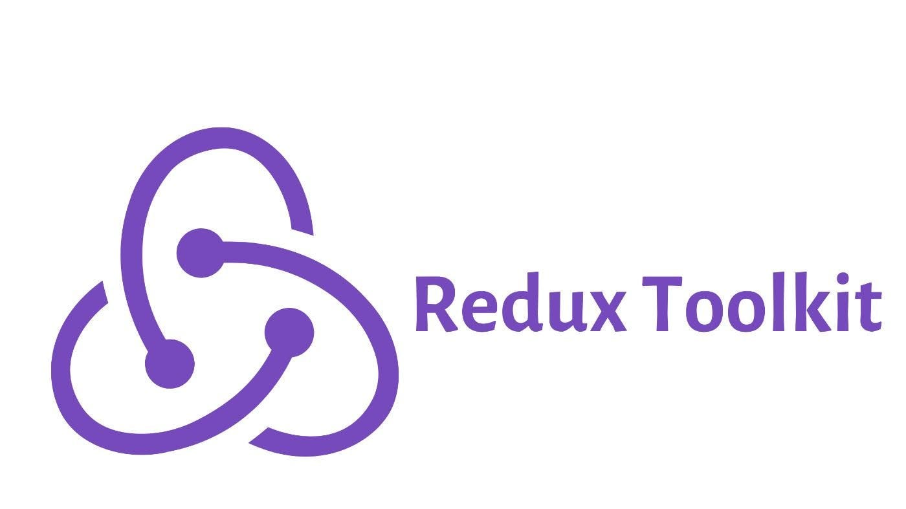

# ```React/Typescript``` Frontend with ```Python/Django``` Backend using ```React Redux Toolkit``` and ```Tailwind CSS```

## Summary of App
A todo app to add, edit, delete and list todos.

There is a registration system and login system.

Each todo belongs to a user

The add, todo list page, edit page and delete are all locked behind a login session.

## ```Technologies Used```


[```React.Js```](https://react.dev/)


[```Typescript```](https://www.typescriptlang.org/)



[```Python```](https://www.python.org/)



[```Django```](https://www.djangoproject.com/)


[```Tailwind CSS```](https://tailwindcss.com/)



[```Redux Toolkit | Redux Toolkit```](https://redux-toolkit.js.org/)![Alt text]

## ```To run Backend locally```
Make sure you have python3 installed

```cd into todo_backend```

```python3 -m venv django-env```!

```source django-env/bin/activate```

```python manage.py makemigrations```

```python manage.py migrate```

```python manage.py runserver```

## ```To run frontend locally```
Make sure you have npm and node.js installed

```npm install```

```npm run start```

```Visit localhost:3000 in browser```
